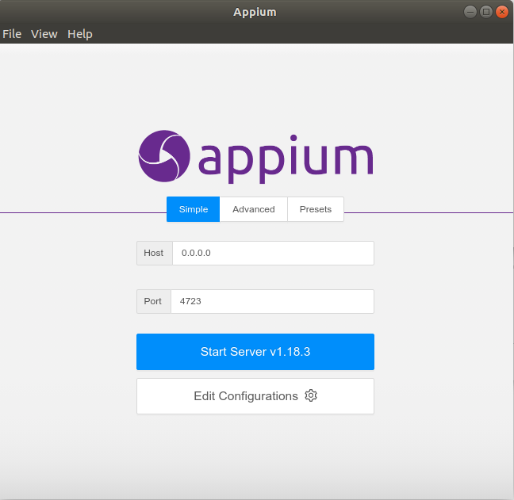
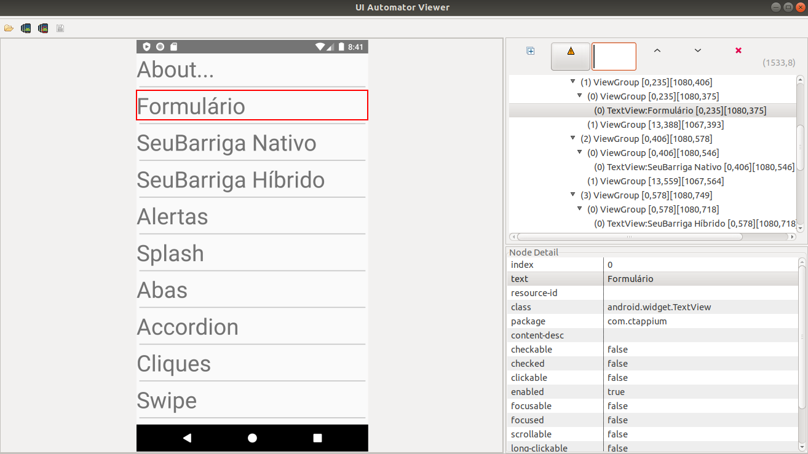
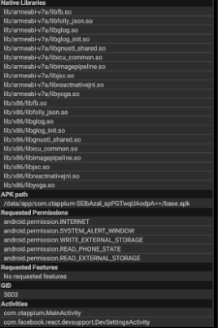
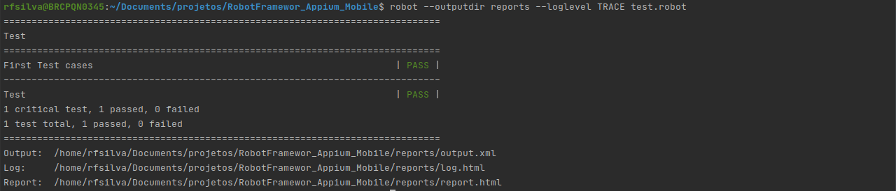

# Robot Framework - Appium - Mobile Automation

Preparamos um script  chamado **dependencies.sh** para facilitar a instalação do Robot Framework e suas dependênicas. 

Para a executar o script acesse a raiz do projeto e execute este comando no terminal:

````
. dependencies.sh
````

Após a execussão do script nós teremos o **Robot Framework** e as seguintes dependências instaladas.

````
Python 3
pip 3
ChromeDriver 88.0.4324.96
build-essential libssl-dev libffi-dev python3-dev
Selenium
Robot Framework
Selenium2library
FakerLibrary
Robot Appium Lib
Appium-Python-Client'
````

Robot Framework é um poderoso framework para automação de tests e tem uma documentação muito boa.

[How to write good test cases using Robot Framework](https://github.com/robotframework/HowToWriteGoodTestCases/blob/master/HowToWriteGoodTestCases.rst)

----

[Robot Framework User Guide](http://robotframework.org/robotframework/#user-guide)

---

[Robot Framework Quick Start Guide](https://github.com/robotframework/QuickStartGuide/blob/master/QuickStart.rst)

---

[SeleniumLibrary Documentation](https://robotframework.org/SeleniumLibrary/SeleniumLibrary.html)

---

## Android Studio

Usaremos o android studio para criarmos nossos emuladores a assim executarmos nossos tests.

#### Dependencias
- [Java](https://www.digitalocean.com/community/tutorials/how-to-install-java-with-apt-on-ubuntu-20-04-pt)

#### Install Visual Studio
- [Download Visual Studio](https://developer.android.com/studio?hl=pt-br)
    - Descompacte o arquivo .zip transferido por download em um local apropriado para seus aplicativos, como */usr/local/*
    
        ````
        tar -vzxf file.zip
        sudo mv ~/Downloads/android-studio/ /usr/local/
        ````
    - Se você estiver usando uma versão de 64 bits do Linux, instale as bibliotecas necessárias para máquinas de 64 bits.
        ````
        sudo apt-get install libc6:i386 libncurses5:i386 libstdc++6:i386 lib32z1 libbz2-1.0:i386
        ````
    - Para iniciar o Android Studio, abra um terminal, navegue até o diretório android-studio/bin/ e execute o arquivo studio.sh
        ```commandline
            cd /usr/local/android-studio/bin/
            ./studio.sh
        ```
    - Selecione se você quer ou não importar as configurações anteriores do Android Studio e clique em **OK**.
    - O assistente de configuração do Android Studio orientará você durante o restante do processo, o que inclui o download dos componentes do SDK do Android que são necessários para o desenvolvimento.
    
#### Android Studio - Variaveis de Ambiente

Abra o arquivo ~/.bashrc e defina as seguintes variáveis relacionadas ao Android.
```commandline
sudo vim ~/.bashrc
```

Adicionar no final do arquivo
```commandline
export ANDROID_HOME=$HOME/Android
export ANDROID_SDK_ROOT=$HOME/Android/Sdk
export PATH=$PATH:$HOME/bin:$ANDROID_SDK_ROOT/tools
export PATH=${PATH}:${ANDROID_SDK_ROOT}/tools
export PATH=${PATH}:${ANDROID_SDK_ROOT}/platform-tools
```

Salve o Arquivo e execute:
```commandline
source ~/.bashrc
```

#### Emuladores - Dispositivos virtuais

Usaremos os emuladores do android studio para executar nossos tests. Segue o link da documentação para criar os emuladores.

[Criar e gerenciar dispositivos virtuais](https://developer.android.com/studio/run/managing-avds?hl=pt-br&authuser=2)


Após a criação dos emuladores podemos verificar quais temos disponíveis/criados utilizando o comando:
```commandline
emulator -list-avds
```

Sabendo quais são nossos emuladores disponíveis podemos executar os mesmos sem abrir o android studio. Isso nos faz economizar recursos.
```commandline
cd $ANDROID_HOME/emulator
./emulator -avd emulator_name
```

Se tiver problemas com Android Studio: /dev/kvm device permission denied, execute estes passos abaixo

```commandline
sudo apt install qemu-kvm
sudo adduser <Replace with username> kvm
```

Se mesmo assim continuar sem premissão execute:
```commandline
sudo chown <Replace with username>T /dev/kvm
```
## Appium
Appium is an open source test automation framework for use with native, hybrid and mobile web apps.

[Appium Documentation](http://appium.io/docs/en/about-appium/intro/)

[Appium For Robot Framework](https://github.com/serhatbolsu/robotframework-appiumlibrary)


### Install Appium
```commandline
> brew install node      # get node.js
> npm install -g appium  # get appium
> npm install wd         # get appium client
> appium                 # start appium server
```

### Install Appium doctor

Appium doctor is very useful to check the configs required for Appium. Install it be this command:

```
npm install appium-doctor -g
$ appium-doctor
```

Verifique as informações do appium doctor e atualizar o que for necessário


### Appium com interface gráfica

- faça dowload do appium AppImage
    - [https://github.com/appium/appium-desktop](https://github.com/appium/appium-desktop/releases/tag/v1.18.3)
- mude a permissão do arquivo

```jsx
chmod u+x arquivo.AppImage
```

- clicar com o botão direito do mouse em cima do arquivo baixado. Depois, com o segundo clique do mouse, selecionar ***Propriedades* -> *Permissões* -> *Criar executável.***
- Então, agora basta clicar no AppImage  e fazer a execussão.




### UI automator Viewer

Aplicativo utilizado para tirar screenshots da tela que está aberta no emulador e assim conseguimos acessar a estrutura do aplicativo e criar localizadores para os elementos.

```commandline
sudo apt install androidsdk-uiautomatorviewer
sudo apt install uiautomatorviewer
```


### Apk info
Aplicativo para pegar os dados detalhados dos apps para test. arrastar o arquivo para o emulador e soltar, isso vai Instalar no emulador e assim podemos pegar informações detalhadas dos aplicativos.

```commandline
File path: apk_info/com.intelloware.apkinfo.apk
```



---
# Executar os tests
- Abra o Emulador
   - Entrar na pasta do emulador
    ```commandline
    cd $ANDROID_HOME/emulator
    ```
  - Verificar a lista de emuladores
  ```commandline
    emulator -list-avds
  ```
  - Executar o emulador desejado. Para este projeto estou usando o Pixel_2_API_26 com a aversão 8 do android 
  ```commandline
     ./emulator -avd Pixel_2_API_26
  ```

- Executar o Appium
  
    ```commandline
    appium
   ```
    
- Executar os tests
    ```commandline
    robot --outputdir reports --loglevel TRACE tests/
   ```
  
Os tests devem ser executados e o resultado no terminal deve ser algo parecido com:

    
 